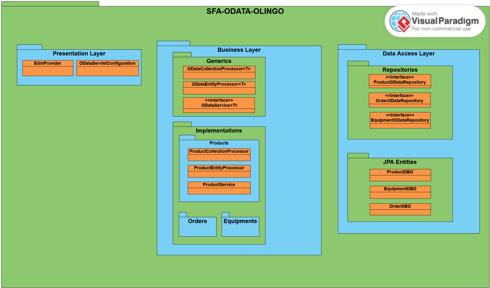
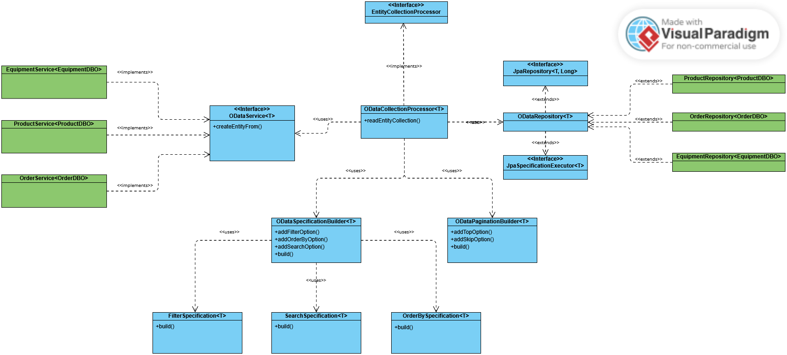
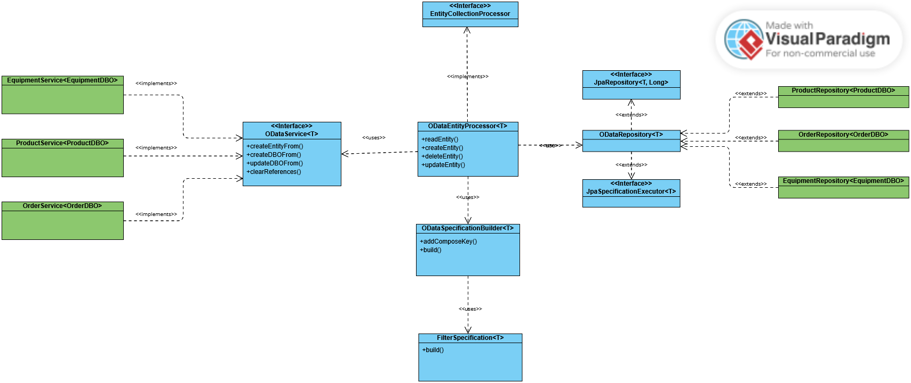

## Application Diagram

### This diagram illustrates the layered architecture of the OData-OLingo-Shop-Floor-Assistance, which is designed to expose OData services using Apache Olingo and follows a structured separation of concerns.

### 1. Presentation Layer

This layer handles OData service configuration and metadata exposure through:

- `EdmProvider` – Defines the entity model structure for OData.

- `ODataServletConfiguration` – Configures the OData service entry point.

### 2. Business Layer

Encapsulates the core business logic, separated into two parts:

- `Generics` – Abstract processors for handling OData entity collections and single-entity operations.

- `Implementations` – Contains concrete implementations for each domain entity (Product, Order, Equipment).

### 3. Data Access Layer

Responsible for persisting and retrieving data, structured as:

- `Repositories` – `ProductODataRepository`, `OrderODataRepository`, and `EquipmentODataRepository` define the interface for data access.
- `JPA entities` - (`ProductDBO`, `OrderDBO`, `EquipmentDBO`) using JPA annotations for ORM mapping.

#### Key Elements:
- 🟧 Orange Rectangle (Java Class / Interface): Represents a class or interface within the system.
- 🟦 Blue or 🟩 Green Rectangle (Package): Represents a package or module within the system.
- - -
## EntityCollectionProcessor Design:

### Diagram Overview:
The EntityCollectionProcessor diagram outlines the software architecture for processing collections of entities in our system. The design follows a modular approach, with clear distinctions between generic classes and specific implementations.
#### Key Elements:

- 🟦 Blue Rectangle (Generic Class/Interface): Represents the core, reusable functionality that can be extended to handle different types of entities. These blue rectangles define the interfaces or generic classes that set the framework for processing the data.

- 🟩 Green Rectangle (Concrete Implementation): Represents specific, concrete implementations of the generic classes or interfaces. These implementations define how entities such as Orders, Products, and Equipments are processed. Each green rectangle is tailored to a specific entity, ensuring flexibility and scalability in the system.

This design ensures that the EntityCollectionProcessor can be easily adapted to handle different types of entities without changing the core structure of the system.

- - -

## EntityProcessor Design:

### Diagram Overview:

Similarly, the EntityProcessor diagram illustrates the detailed design for processing individual entities within the system, following the same approach of separation between generic functionality and specific implementations.

#### Key Elements:

- 🟦 Blue Rectangle (Generic Class/Interface): Again, this represents the foundational, reusable interface or generic class that provides the structure for processing individual entities. It ensures that common functionality is shared across various entity processors.

- 🟩 Green Rectangle (Concrete Implementation): These green rectangles represent the specific implementations for processing individual entities, such as Orders, Products, and Equipments. Each entity processor is designed to handle the specific business logic and processing rules required for that entity type.

By maintaining this separation, the EntityProcessor design promotes modularity, allowing for easy expansion and modification of the system without impacting other components.

- - - 

## Future Development:

To extend the system with additional entities and their corresponding services, repositories, and processors, the following steps should be followed. These steps outline the necessary actions for adding a new entity and its related components to the system:

### Step 1: Add the Entity and Entity Set in [EdmProvider](../backend/shop-floor-assistance-backend/src/main/java/com/shopfloor/backend/olingo/presentation/EdmProvider.java)
- The first task is to define a new Entity and its corresponding Entity Set in the [EdmProvider](../backend/shop-floor-assistance-backend/src/main/java/com/shopfloor/backend/olingo/presentation/EdmProvider.java) class.
- This will allow the new entity to be exposed through OData services, making it accessible for querying and manipulation.
- Add needed basic, referential, and navigation properties for the new entity.

### Step 2: Implement the Corresponding Service in [ODataService<T>](../backend/shop-floor-assistance-backend/src/main/java/com/shopfloor/backend/olingo/business/generics/ODataService.java)
- Create a new service class that implements the [ODataService<T>](../backend/shop-floor-assistance-backend/src/main/java/com/shopfloor/backend/olingo/business/generics/ODataService.java) interface, where `T` represents the database object that serves as the representation of the entity at the surface level.
- This service should contain the necessary business logic and data handling for the new entity.

### Step 3: Create the Corresponding [ODataRepository<T>](../backend/shop-floor-assistance-backend/src/main/java/com/shopfloor/backend/olingo/database/ODataRepository.java)
- Implement a new [ODataRepository<T>](../backend/shop-floor-assistance-backend/src/main/java/com/shopfloor/backend/olingo/database/ODataRepository.java) where `T` again represents the database object responsible for mapping the entity to the database.
- This repository will handle CRUD operations and facilitate communication between the service layer and the database.

### Step 4: Register the Concrete Collection or Entity Processor
- Register the concrete collection or entity processor within the system, ensuring that it is properly mapped to the corresponding service and repository.
- Follow the example implementation provided for existing entities such as [Orders](../backend/shop-floor-assistance-backend/src/main/java/com/shopfloor/backend/olingo/business/implementations/orders), [Products](../backend/shop-floor-assistance-backend/src/main/java/com/shopfloor/backend/olingo/business/implementations/products), and [Equipment](../backend/shop-floor-assistance-backend/src/main/java/com/shopfloor/backend/olingo/business/implementations/equipments).

### Step 5: Register the New Bean in [ODataServletConfiguration](../backend/shop-floor-assistance-backend/src/main/java/com/shopfloor/backend/olingo/presentation/ODataServletConfiguration.java)
- In the [ODataServletConfiguration](../backend/shop-floor-assistance-backend/src/main/java/com/shopfloor/backend/olingo/presentation/ODataServletConfiguration.java) class, add a new bean for the newly created Entity Set.
- This ensures that the new entity set is available and correctly integrated into the OData service, following the pattern used for existing entities.

---

By following these steps, developers will be able to efficiently extend the system with additional entities, ensuring consistency and maintainability across the platform.
## DISCLAIMER 
The whole application is secured by JWT authentication and authorization. 
The `/odata/**` is left unsecured for the purpose of this project. But if the development is to be continued, it is recommended to secure the `/odata/**` endpoints as well. Check [SecurityConfig](../backend/shop-floor-assistance-backend/src/main/java/com/shopfloor/backend/security/SecurityConfig.java).
A user with credentials username: `olingo`, password: `olingo`, and assigned role `OLINGO` is created for testing purposes. Check [DBInitializer](../backend/shop-floor-assistance-backend/src/main/java/com/shopfloor/backend/DBInitializer.java).
If the endpoints are to be secured, the user should be used to retrieve the JWT token and use it to access the `/odata/**` endpoints.